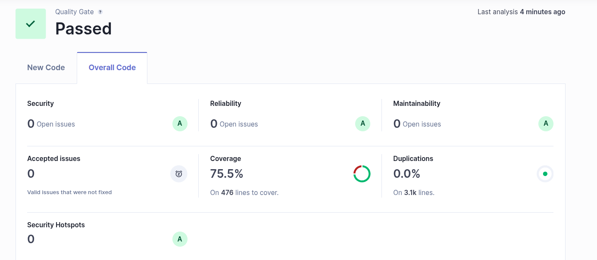

#Rendcore budget


**Rendcore budget** è un applicativo backend del sistema **Rendcore**  dedicato alla **gestione contabile**.

Applicativo consente di :

- registrare nuove richieste spesa dai dipendenti autorizzati a richiederle
- monitoraggio delle richieste spesa divise per tipologia
- genera report di rendicontazione economica esportabili in formato XLSX (Excel)
- genera report di rendicontazione economica in CSV e possibilità di esportare intero database nel medesimo formato

--- 

### 1. Configurazione Dettagliata

---

#### **Setup del Database in Locale**

**Tipo di database:** PostgreSQL 17.2  
**Porta:** ```5432``` (host) → ```5432``` (container)  
**Avviamento del database:** vedi sezione **Avviamento dell'applicativo**.
**Migrazione:** All'avvio del database viene eseguito il file ```init-db.sql```. All'avvio dell'applicativo viene seguita la migrazione per popolare lo schema automaticamente tramite ***flyway*** .


#### **Mapping delle porte**

Per questo applicativo verranno utilizzate le seguenti porte:

- **rendcore-budget ***(backend)*****:
  - Ambiente **Dev** : ```8090```
  - Ambiente **Test** : ```8091```

- ***Port forwarding dei container docker***:
  - **PostgreSQL** utilizza: ```5432``` (mappata alla porta ```5432``` del container)
  - **Smtp4dev** utilizza:
    - protocollo SMTP utilizza: ```1025``` (mappata alla porta ```25``` del container)
    - Interfaccia web, UI: ```2500``` (mappata alla porta  ```80``` del container)


#### **Configurazione SMTP**
Attualmente SMTP non viene utilizzata, maggiori informazioni verranno rilasciate quando l'applicativo utilizzerà SMTP.


---
### 2. **Struttura del Progetto**

---


#### rendcore-budget **Backend***

Panoramica delle directory principali dell'applicativo:

- **`/docker-compose`**: Contiene tutti i file necessari per l'avvio dei container Docker e la loro inizializzazione per far partire il progetto in locale.
- **`/resources/dbinit/postgres`**: Contiene tutti i file `.sql` necessari a ***Flyway*** per effettuare la migrazione del database all’avvio dell'applicativo.
- **`/java/.../api`**: Contiene le classi `resource` che espongono gli endpoint dell'applicativo.
- **`/java/.../config`**: Contiene le classi di configurazione aggiuntiva dell'applicativo.
- **`/java/.../dto`**: Contiene i `Data Transfer Object` utilizzati per lo scambio dati tra i componenti.
- **`/java/.../exception`**: Contiene le classi che definiscono le `ServiceException` personalizzate per la gestione delle eccezioni.
- **`/java/.../model`**: Contiene le classi che definiscono le `entity` del database e dell'applicativo.
- `/java/.../security`: Contiene le classi per la gestione della sicurezza e dell'ispezione del **JWT** (`Json Web Token`).
- **`/java/.../service`**: Contiene le classi che gestiscono la logica di business dell'applicativo.
- **`/java/.../utils`**: Contiene le classi di utilità dell'applicativo.


---

### 3. **Avvio in ambiente locale**

---

#### **rendcore-budget *Backend***

Per avviare l'applicativo **rendcore-budget**  utilizzare il terminale e posizionarsi nella root della cartella dell'applicativo (`backend`):
##### **Docker**
Utilizzando il terminale posizionarsi nella cartella `docker-compose`  ed eseguire il comando :
```bash
docker compose up -d
```

##### **Applicativo backend**
Utilizzando il terminale posizionarsi nella root della cartella progetto ed eseguire il comando:

```bash
./mvnw quarkus:dev
```

*Nota: rendcore-budget richiede che l'applicativo rendcore-employee sia in funzione prima di essere avviato.*

---

### 4. **API Documentation**
La documentazione inerente alle API è presente nello `Swagger UI`.
Esso è raggiungibile, una volta avviato l'applicativo backend, premendo il tasto *d* mentre ci si trova nel suo terminale oppure al seguente link  [Swagger UI](http://localhost:8090/api/v1/rendcore-budget/q/dev-ui/quarkus-smallrye-openapi/swagger-ui)

#### Health Check
Il progetto include dei health check per verificare lo stato dei servizi:

- Sono definiti anche nelle proprietà del backend, all’interno di **`application.properties`**, con root path `/api/v1/health`.


---

###  5. **Integrazione con sistemi esterni**

L’applicativo  chiama sistemi terzi, come descritto di seguito:

#### Sistemi esterni chiamati

- **rendcore-employee**  
  Interroga l’applicativo per il recupero di alcune informazioni di base del profilo di uno specifico dipendente. Esso avviene tramite il `Rest Client`  **EmployeeClient** .

---

### 6. **Testing**

L'applicativo è già configurato per supportare `SonarQube` e `Jacoco`.
#### **rendcore-budget Test**

Posizionarsi nella root dell'applicativo da un terminale ed eseguire il comando:
```bash
mvn clean verify
```
Il report generato da `Jacoco` sarà disponibile in:
`/target/site/jacoco/index.html`

##### **Analisi con SonarQube**

Per eseguire l’analisi con `SonarQube`:

1. Aprire il file `pom.xml` e inserire i valori corretti per le seguenti voci:
   ```bash
	<sonar.host.url>URL_DI_SONARQUBE</sonar.host.url>  
	<sonar.projectKey>PROJECT_KEY</sonar.projectKey>
	```

2. Utilizzare il comando fornito direttamente dalla console di `SonarQube` nel terminale dell'applicativo.

**Nota**: assicurarsi di essere posizionati nella root del progetto quando si esegue il comando.

**Risposte** :Nel terminale, i test possono restituire uno dei seguenti messaggi:
```
BUILD FAILURE <- In caso di fallimento dei test
BUILD SUCCESS <- In caso di successo dei test
```

In entrambi i casi, sarà possibile visualizzare un resoconto dettagliato nel terminale, simile al seguente:

```
Tests run: N, Failures: K, Errors: Q, Skipped: X
```

Stato attuale del test `sonarqube` , rilevato il giorno 01/01/2026 .


